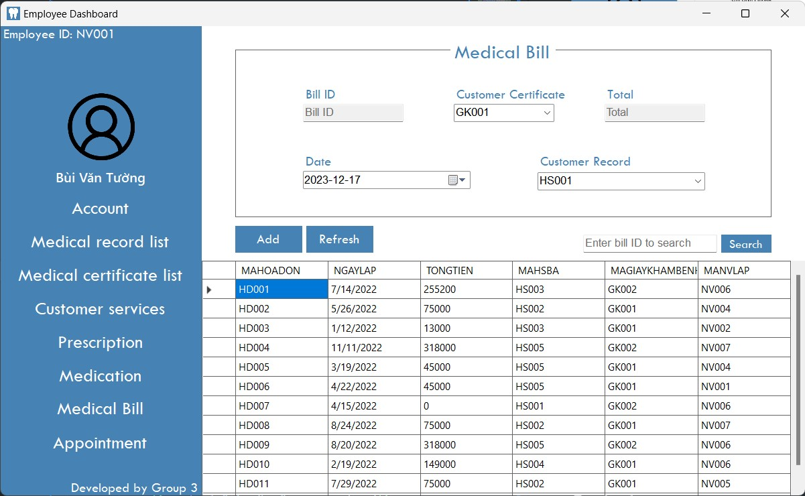

# DBMS - QLNhaKhoa and Concurrency

-   Group project from HCMUS's 2023 Database Management System course.

  
  

  
  

  
Table of Contents

  <ul>
    <li>
      <a href="#content">Content</a>
      <ul>
        <li><a href="#qlnhakhoa-qlnk_release-and-assets">QLNhaKhoa, QLNK_Release and assets</a></li>
        <li><a href="#sql">SQL</a></li>
      </ul>
    </li>
    <li>
      <a href="#getting-started">Getting Started</a>
      <ul>
        <li><a href="#prerequisites">Prerequisites</a></li>
        <li><a href="#installation">Installation</a></li>
      </ul>
    </li>
    <li>
      <a href="#usage">Usage</a>
      <ul>
        <li><a href="#to-set-up-the-database">To set up the database</a></li>
        <li><a href="#to-run-qlnhakhoa-application">To run QLNhaKhoa application</a></li>
        <li>
          <a href="#to-observe-or-fix-concurrency-conflicts">To observe or fix concurrency conflicts</a></li>
          <ul>
            <li><a href="#in-dbms">In DBMS</a></li>
            <li><a href="#in-qlnhakhoa-app">In QLNhaKhoa app</a></li>
          </ul>
        </li>
      </ul>
    </li>
    <li><a href="#built-with">Built With</a></li>
    <li><a href="#meet-the-team">Meet The Team</a></li>
  </ul>

## Content

-   `Project.pdf` contains all the tasks and requirements of the project (in Vietnamese).
-   `Report.pdf` includes our documentation for all the designs and required tasks (in Vietnamese).

### `QLNhaKhoa`, `QLNK_Release` and `assets`

Source code, release build, and resources pertaining to the C# WinForms app.

**_CAUTION: The application will continue running in the background, even after closing the interface, in both of these circumstances,_**

-   By executing the `QLNhaKhoa.exe` in `QLNK_Release`,
-   By `Start Without Debugging (Ctrl + F5)` in Visual Studio.

**_It should be manually killed with Task Manager, by searching for `QLNhaKhoa`._**

### `SQL`

All folders and files are pretty self-explanatory, but here are some notable things,

-   `setupDB.bat` constructs the database and populating all data.
-   `concurrency` holds implementations and solutions to Concurrency Conflict scenarios.

## Getting Started

### Prerequisites

-   Windows 10 or 11.
-   **_For WinForms development:_**
    -   Visual Studio 2022 and its `.NET desktop development` workload.
-   SQL Server 2022 Developer and SQL Server Management Studio (SSMS) 19.2.
-   _(Optional)_ Any decent code editor, preferably VSCode.
    -   It just makes editing the database's source code easier.

### Installation

-   Clone the repo.

(<a href="#readme-top">back to top</a>)

## Usage

### To set up the database

1. Start the `SQL Server` and connect to it.
    - Make sure you have sufficient privileges.
1. Navigate into `SQL` folder.
1. Run `setupDB.bat`.
    - All data are inserted using stored procedures. With the strict constraints on some tables' insertion, it is expected that many data won't pass the checks.

### To run QLNhaKhoa application

1. Finish [setting up the database](#to-set-up-the-database).
1. Navigate into `QLNK_Release`.
1. Run `QLNhaKhoa.exe`.

**_CAUTION: The application will continue running in the background even after closing the interface. It should be manually killed with Task Manager, by searching for `QLNhaKhoa`._**

### To observe or fix concurrency conflicts

#### In DMBS

1. Start the `SQL Server` and connect to it.
    - Make sure you have sufficient privileges.
1. Navigate into `SQL\concurrency\co` folder, with `co` being the conflict of choice.
1. Run `co.sql` to replace all base procedures with the _defective_ or _fixed_ ones.
1. Run `tran1.sql` then `tran2.sql` right after.
    - For the best experience, each file should be opened in an instance of SSMS, both of which should be placed side by side.
        - Refer to [MSSQL Isolation Level Demos](https://www.youtube.com/playlist?list=PLS2xabqmZjj0YFdhA56XsoM4gN1fmNp8e) by [CodeCowboyOrg](https://www.youtube.com/@CodeCowboyOrg).

#### In QLNhaKhoa app

1. Start the `SQL Server` and connect to it.
    - Make sure you have sufficient privileges.
1. Navigate into `SQL\concurrency\co` folder, with `co` being the conflict of choice.
1. Run `co.sql` to replace all base procedures with the _defective_ or _fixed_ ones.
1. Run 2 instances of QLNhaKhoa side by side, [following the above steps](#to-run-qlnhakhoa-application).
1. Perform actions that are relevant to the conflicts' scenarios.
    - Now, this step is very difficult to explain because the possiblities are _endless_. Basically, just experiment.
    - For pointers, you may look into all the `tran1.sql`s and `tran2.sql`s, then try to translate those queries onto the app.

## Built With

[vsicon]: https://skillicons.dev/icons?i=visualstudio&theme=dark
[vsurl]: https://visualstudio.microsoft.com/vs/
[dotneticon]: https://skillicons.dev/icons?i=dotnet
[dotneturl]: https://dotnet.microsoft.com/en-us/download/dotnet/8.0
[sqlservericon]: https://upload.wikimedia.org/wikipedia/de/thumb/8/8c/Microsoft_SQL_Server_Logo.svg/90px-Microsoft_SQL_Server_Logo.svg.png
[sqlserverurl]: https://www.microsoft.com/en-us/sql-server/sql-server-downloads
[ssmsicon]: https://i.imgur.com/cIfvzqP.png
[ssmsurl]: https://learn.microsoft.com/en-us/sql/ssms/download-sql-server-management-studio-ssms?view=sql-server-ver16
[vscodeicon]: https://skillicons.dev/icons?i=vscode&theme=dark
[vscodeurl]: https://code.visualstudio.com/
[windowsicon]: https://cdn.jsdelivr.net/gh/devicons/devicon/icons/windows8/windows8-original.svg
[windowsurl]: https://www.microsoft.com/en-us/windows/

| [![VisualStudio2022][vsicon]][vsurl] | [![.NET8.0][dotneticon]][dotneturl] | [![SQLServer][sqlservericon]][sqlserverurl] | [![SSMS][ssmsicon]][ssmsurl] | [![VSCode][vscodeicon]][vscodeurl] | [![Windows][windowsicon]][windowsurl] |
| :----------------------------------: | :---------------------------------: | :-----------------------------------------: | :--------------------------: | :--------------------------------: | :-----------------------------------: |
|             2022 v17.8.3             |                 8.0                 |               Developer 2022                |          19.2.56.2           |               1.85.0               |     &nbsp;&nbsp; 11 &nbsp;&nbsp;      |

## Meet The Team

  &nbsp;&nbsp;&nbsp;
  &nbsp;&nbsp;&nbsp;
  &nbsp;&nbsp;&nbsp;
  &nbsp;&nbsp;&nbsp;

(<a href="#readme-top">back to top</a>)

